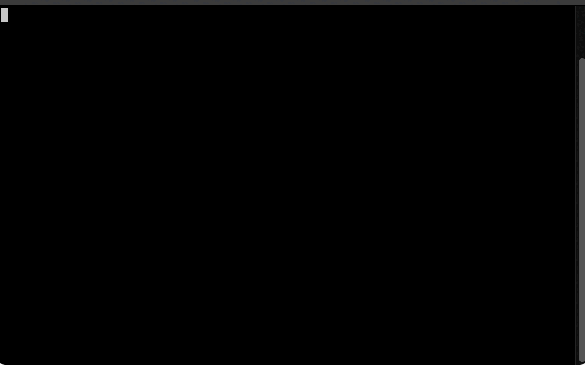

# doppelganger

Save and load your shell environment to create doppelganger shells!

Ever been in one shell, in a specific folder, with some environment active, and then wanted to be in the same place in another? Then doppelganger is for you! The `dgs` command will save the current shell setup (functions, local variables and environment variables), and then `dgl` can be used to load them into a different shell. Your original shell can also still be active.

Please note, this is early software and has had minimal testing with zsh and bash on a mac. Issues and pull requests welcome!

## Installation

Simply `git clone` this repository somewhere, let's say you put it in `$HOME/doppelganger`. Then simply add `source $HOME/doppelganger/doppelganger.sh` to your `.bashrc` or `.zshrc` file.

## Usage

The following commands will be available when doppelganger is installed:

* `dgs` - Save current shell environment
* `dgl` - Load last saved shell environment
* `dgc` - Cleanup last saved environment
* `dgu` - Update to latest version

